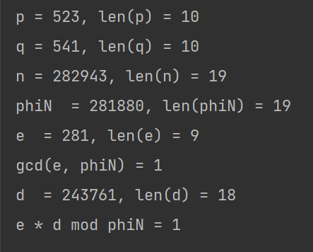
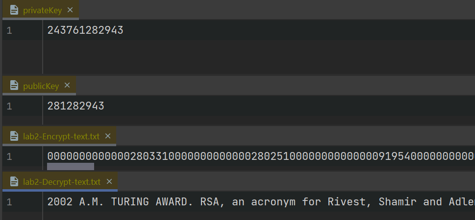
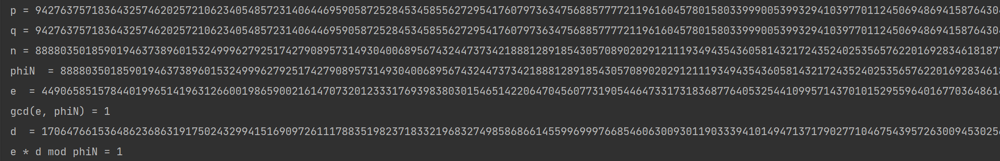
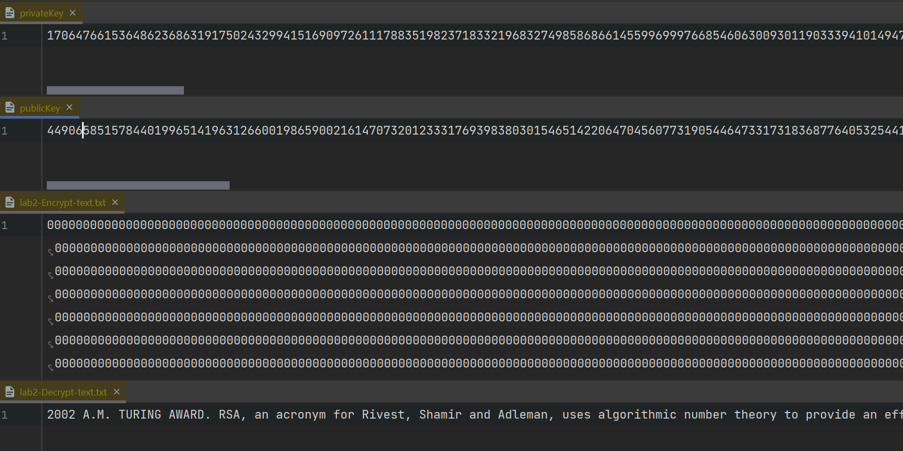

# rsa

学校的 rsa 实验

## 运行截图

n = 10 的示例

n = 1024 的示例

## 实验遇到的问题

1. 一开始不知道不能调库，去网上了解了一下 RSA 相关的库，还涉及到 Base64 编码，写好了才听老师说不可以用。解决办法是自己写一个。
2. 指导书上介绍的编码方式是不对的。解决办法是自己设计编码。
3. py 不太熟悉，开始写实验的时候比较头疼。解决办法是用熟悉的 Java 写。

## 字符分组方式

- 从文件读入待加密的明文

就算是可打印的 ASCII 编码，十进制表示编码的话也达到了三位数，如 z 编码是 122。

故而如果一次读入两个字符的话，需要将其转化为最高为 6 位的十进制数。

- 每次读入两个 byte, 如 a, b；
- ascii 码为 97 98；
- 将其组合为 097098 的 最高为 6 位的十进制数。

如果最后没有读满两个字符的话，就用 000 补足。

**（from in file）明文字符序列 -> 明文编码序列，其中的元素是最高为 6 位的十进制数；映射是 ASCII。**

- 加密

明文分组的长度是远小于 nLength 的，但密文分组长度 <= nLength，并且这个分组长度不是固定的。

**明文编码序列 -> 密文编码序列**

- 写入密文文件

上面说到，密文分组长度 <= nLength 且不固定。考虑到之后读入密文文件，我们需要在写入密文文件时对密文分组补充长度至 nLength。补充的方法是在密文分组前补充相应数量的 0。

写入密文文件的是所有补充完前导 0 的十进制密文分组的字符串，这里就不需要再转化成 UTF-8 或者 ASCII 了。

**密文编码序列 -> 补充完前导 0 的十进制密文分组的字符串序列 -> 密文字符序列（to en file）**

- 读入密文文件

一次读入 nLength 长度的字符数组，去掉前导 0，重新变为十进制密文分组，直到读完。

**（from en file）密文字符序列 -> 密文编码序列**

- 解密

**密文编码序列 -> 明文编码序列**

- 写入解密文件

按照最开始的编码方式解码。

把每一个解密明文分组，也就是最高为 6 位的十进制数，重新拆分为两个十进制数，转换为两个字符。最后如果有 000 就忽略。

**解密得到的明文编码序列 -> 明文字符序列（to de file）**

## 算法

大致复习 RSA

参数：

需要两个大素数 p，q

得到大素数乘积 n，其欧拉函数值 phi_n

找到一个小于 phi_n 的，且和 phi_n 互素（最大公因数为 1）的 e

求出 e 的逆元 d（模 phi_N 意义下）

加密：

c = m^e mod n

解密：

d = c^d mod n

所以需要以下算法：

生成大素数（参数是素数长度）：Miller-Rabin 算法

求最大公因数：欧几里得算法

求模逆元：拓展欧几里得算法

快速模幂：用到了同余性质

## java 实现

很幸运的是 java 里 BigInteger 类包含了上面提到的所有算法。（乐）

